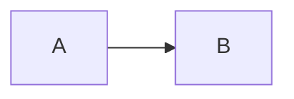

## Extended Markdown and YFM

Use the `full` toolbar preset when you want buttons for every feature in this page. Toolbar presets only choose buttons: the editor always parses and serializes its extended Markdown schema, so changing between `zero`, `commonmark`, `default`, and `full` does not change round-trip support. `MarkdownRenderer` understands the renderer syntax below; math and Mermaid need the noted adapters, while YFM HTML is rendered as escaped source.

| Feature | Syntax | Visual | Markup | Renderer | Requirements / round-trip |
| --- | --- | ---: | ---: | ---: | --- |
| Strike | `~~text~~` | ✓ | ✓ | ✓ | `default`/`full` include a button |
| Underline | `++text++` | ✓ | ✓ | ✓ | `full` includes a button; serializer emits `++`, never `__` |
| Highlight / subscript | `==text==`, `H~2~O` | ✓ | ✓ | ✓ | `full` includes buttons |
| Color | `<span style="color: #5282ff">text</span>` | ✓ | ✓ | ✓ | `full` includes a button; parser accepts the known color span only |
| Tables | pipe table with `:---:` | ✓ | ✓ | ✓ | `full` includes a button; alignment is preserved |
| Definition list | `Term` then `: definition` | ✓ | ✓ | ✓ | no built-in toolbar button |
| Heading attributes | `## Name {#id .one .two}` | ✓ | ✓ | ✓ | syntax accepts id/classes, but current parser retains the last class only |
| Folding heading | `##+ Name` | ✓ | ✓ | ✓ | `full` includes a button; boundary ends at equal/higher heading |
| Quote link | `> [Source](url){data-quotelink=true}` | ✓ | ✓ | ✓ | no built-in toolbar button; following quote text is associated |
| Directive | `::: note` … `:::` | ✓ | ✓ | ✓ | registered component required for component view |
| Inline / block math | `$x$`, `$$…$$` | ✓ | ✓ | ✓ | `full` includes a button; rendered output needs `features.math`; failed render remains source |
| Mermaid | `````mermaid` fence | ✓ | ✓ | ✓ | `full` includes a button; rendered output needs `features.mermaid`; source remains fallback |
| Image attributes | `{width=100% object-fit=contain}` | ✓ | ✓ | ✓ | `full` includes a button; width/height/object-fit only |
| New-window link | `[Text](url){target="_blank"}` | ✓ | ✓ | ✓ | parser maps target and emits safe `rel` |
| Breaks | two spaces / `\\` / newline | ✓ | ✓ | ✓ | hard break vs soft break follows `preferredBreak` |

````markdown
# Guide {#guide .page-title .wide}

##+ Folded section
It ends before the next `##` or `#` heading.

~~removed~~, ++underlined++, ==marked==, H~2~O and <span style="color: #5282ff">blue</span>.
Inline $E=mc^2$.

$$
\int_0^1 x dx
$$



{width=100% object-fit=contain}
[External](https://example.com){target="_blank"}

Hard break  
soft break

Term
: Definition

> [Source](https://example.com){data-quotelink=true}
Quote text.

::: note
Component content
:::

::: html
<strong>Trusted directive HTML</strong>
:::

:::html
<section>YFM HTML source</section>
:::

<div>Raw block HTML is source text.</div>
````

Raw block HTML is rendered as text. `::: html` is directly trusted HTML and must be sanitized by the application. `:::html` is a YFM source block: in the visual editor, `features.html` must return safe DOM; `MarkdownRenderer` always renders this block as escaped source. Known inline `<u>` and color spans are constrained by the parser; arbitrary inline HTML is not a general HTML pass-through.

```vue
<script setup lang="ts">
import {ref} from 'vue'
import {MarkdownEditor} from 'hexagon-editor'
const value = ref('##+ Details\n\n++Important++ and $E=mc^2$.')
</script>
<template><MarkdownEditor v-model="value" toolbar-preset="full" /></template>
```
