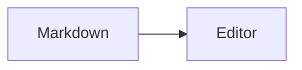

# hexagon-editor

`hexagon-editor` — Vue 3-редактор Markdown и YFM. Он умеет работать в визуальном (`wysiwyg`), исходном (`markup`) и разделённом (`split`) режимах, а также поставляет лёгкий SSR-совместимый рендерер для страниц, где редактирование не требуется.

## Установка

```bash
pnpm add hexagon-editor
```

Единственная peer dependency — Vue `^3.5.0`. Подключите stylesheet явно: библиотечные JS entry point'ы не импортируют CSS как side effect.

```ts
// nuxt.config.ts
export default defineNuxtConfig({
    css: ['hexagon-editor/style.css'], // редактор и рендерер
});
```

Для страницы только с предпросмотром достаточно меньшего набора стилей:

```ts
export default defineNuxtConfig({
    css: ['hexagon-editor/renderer.css'],
});
```

### Обычный Vue 3 / Vite

В обычном Vue-приложении импортируйте stylesheet один раз в точке входа. Все примеры пакета используют TypeScript, поэтому файл называется `main.ts`:

```ts
// src/main.ts
import {createApp} from 'vue';
import App from './App.vue';
import 'hexagon-editor/style.css';

createApp(App).mount('#app');
```

Если приложение использует только `MarkdownRenderer`, вместо полного stylesheet подключите более компактный:

```ts
// src/main.ts
import {createApp} from 'vue';
import App from './App.vue';
import 'hexagon-editor/renderer.css';

createApp(App).mount('#app');
```

Импортируйте stylesheet один раз на стороне приложения. Это особенно важно для SSR и для сборщиков, которые не добавляют CSS-asset библиотеки автоматически.

## Быстрый старт

```vue
<script setup lang="ts">
import {ref} from 'vue';
import {MarkdownEditor} from 'hexagon-editor';

const markdown = ref('# Документ\n\nНачните писать…');
const mode = ref<'wysiwyg' | 'markup' | 'split'>('wysiwyg');
</script>

<template>
  <MarkdownEditor
    v-model="markdown"
    v-model:mode="mode"
    locale="ru"
    theme="auto"
  />
</template>
```

`v-model` всегда содержит Markdown-исходник, независимо от текущего режима. Режимы: `wysiwyg` — визуальный редактор, `markup` — редактор исходного Markdown, `split` — оба представления одновременно.

## Возможности Markdown и YFM

Редактор поддерживает следующие конструкции; preset `full` добавляет кнопки для всех доступных действий панели.

| Категория | Возможности |
| --- | --- |
| CommonMark | заголовки, абзацы, цитаты, горизонтальные правила, ссылки, изображения, inline/fenced code, вложенные маркированные и нумерованные списки, переносы |
| Форматирование | **жирный**, *курсив*, `inline code`, зачёркивание, подчёркивание, выделение (`==text==`), нижний индекс |
| Структура | таблицы с выравниванием, definition lists, атрибуты заголовков, сворачиваемые заголовки `##+` |
| YFM и расширения | quote links, блоки raw HTML, YFM HTML `:::html`, пользовательские директивы `::: name`, LaTeX, Mermaid |

Пример документа, покрывающий расширенные возможности:

````markdown
# Справка {#guide .page-title}

##+ Сворачиваемый раздел

**Жирный**, *курсив*, ~~зачёркнутый~~, __подчёркнутый__, ==выделенный== и H~2~O.

> Цитата

> [Источник цитаты](https://example.com/source){data-quotelink=true}

Текст quote link.

[Ссылка](https://example.com "Подсказка") и 

Термин
: Определение

| Слева | По центру | Справа |
| :--- | :---: | ---: |
| 1 | 2 | 3 |

Формула: $E = mc^2$

$$
\sum_{i=1}^{n} i = \frac{n(n + 1)}{2}
$$



:::html
<section>Доверенный YFM HTML</section>
:::
````

Формулы и Mermaid сохраняются и редактируются без дополнительных пакетов. Для их визуального рендеринга передайте адаптеры из раздела «Опциональные движки». Некорректная Mermaid-диаграмма остаётся видимой как исходный текст.

## `MarkdownEditor`: props, события и слоты

```vue
<script setup lang="ts">
import {ref} from 'vue';
import {MarkdownEditor} from 'hexagon-editor';

const value = ref('');
const mode = ref<'wysiwyg' | 'markup' | 'split'>('split');

function save(markdown: string) {
    console.log(markdown);
}
</script>

<template>
  <MarkdownEditor
    v-model="value"
    v-model:mode="mode"
    locale="en"
    theme="dark"
    placeholder="Write a document"
    toolbar-preset="full"
    @change="save"
    @mode-change="console.log('mode:', $event)"
  />
</template>
```

| Prop | Тип / значение по умолчанию | Назначение |
| --- | --- | --- |
| `modelValue` | `string`, `''` | Markdown-значение для `v-model` |
| `mode` | `wysiwyg \| markup \| split`, `wysiwyg` | Режим, поддерживает `v-model:mode` |
| `locale` | `ru \| en`, `ru` | Язык интерфейса |
| `theme` | `auto \| light \| dark`, `auto` | Тема интерфейса |
| `placeholder` | `string`, `''` | Текст пустого визуального редактора |
| `readonly` | `boolean`, `false` | Режим чтения: панель инструментов скрыта |
| `toolbarPreset` | см. ниже, `default` | Встроенная конфигурация панели |
| `toolbarConfig` | `MarkdownEditorToolbarConfig` | Полностью заменяет выбранный preset |
| `features` | `MarkdownFeatures` | Адаптеры математики, Mermaid и trusted HTML |
| `directiveComponents` | `Record<string, Component>` | Vue-компоненты для блоковых директив |
| `uploadImage` | `(file: File) => Promise<string>` | Обработчик загрузки в форме изображения |

`modelValue`, `mode`, `locale`, `toolbarPreset`, `toolbarConfig`, `theme` и `uploadImage` обновляются без перемонтирования компонента. Изменение `mode`, `readonly` или `features` пересоздаёт editor hosts, поэтому текущие selection и история undo/redo сбрасываются. `placeholder` и `directiveComponents` применяются при следующем монтировании; чтобы обновить их у уже созданного редактора, измените его `:key`.

События: `update:modelValue`, `change` (новый Markdown), `update:mode` и `mode-change` (новый режим), а также `submit` и `cancel` без параметров. Последние возникают в визуальном редакторе по `Mod+Enter` и `Escape`; в режиме `markup` на них полагаться не следует. Компонент также принимает:

- слот `header` — содержимое над toolbar;
- слот `toolbar` — дополнительное содержимое после встроенных групп toolbar; он их не заменяет. В slot props передаются `{commands, execute}`.

В режиме `readonly` исходник не меняется; `MarkdownRenderer` обычно лучше подходит для публичного отображения документов.

### Методы через template ref

```vue
<script setup lang="ts">
import {ref} from 'vue';
import {MarkdownEditor} from 'hexagon-editor';
import type {MarkdownEditorExposed} from 'hexagon-editor';

const editor = ref<MarkdownEditorExposed>();

async function insertTemplate() {
    editor.value?.append('## Новый раздел');
    await editor.value?.setMode('markup');
    editor.value?.moveCursor('end');
    editor.value?.focus();
}
</script>

<template>
  <button @click="insertTemplate">Добавить раздел</button>
  <MarkdownEditor ref="editor" v-model="value" />
</template>
```

Доступны `focus()`, `hasFocus()`, `getValue()`, `setValue()` и синоним `replace()`, `clear()`, `prepend()`, `append()`, `insert()`, `isEmpty()`, `getMode()`, `setMode()` и `moveCursor('start' | 'end' | {line})`. В `split` позиция `{line}` применяется к исходному редактору.

## Панель инструментов

Presets: `zero`, `commonmark`, `default`, `full` и совместимый `minimal`.

| Preset | Содержимое |
| --- | --- |
| `zero` | undo / redo |
| `commonmark` | история, жирный, курсив, заголовки, списки, ссылка, цитата, code, code block, горизонтальное правило |
| `default` | `commonmark` + зачёркивание |
| `minimal` | история, базовое форматирование, списки, цитата, сворачиваемые заголовки, ссылка |
| `full` | все кнопки пакета, включая underline, mark, image, formula, Mermaid, YFM HTML и таблицы |

Все идентификаторы кнопок: `undo`, `redo`, `heading`, `bold`, `italic`, `underline`, `strike`, `mark`, `code`, `bullet-list`, `ordered-list`, `quote`, `fold-heading`, `code-block`, `code-language`, `link`, `color`, `image`, `formula`, `mermaid`, `html`, `horizontal-rule`, `table`.

Соберите панель с нужным порядком и контекстными условиями:

```ts
import {
    createToolbarConfig,
    createToolbarGroup,
    createToolbarItem,
} from 'hexagon-editor';
import type {MarkdownEditorToolbarConfig} from 'hexagon-editor';

export const toolbar: MarkdownEditorToolbarConfig = createToolbarConfig([
    createToolbarGroup('history', ['undo', 'redo']),
    createToolbarGroup('text', ['heading', 'bold', 'italic', 'code']),
    createToolbarGroup('insert', [
        'link',
        createToolbarItem('table', {
            isAvailable: (state) => !state.codeBlock,
        }),
    ]),
]);
```

```vue
<MarkdownEditor v-model="value" :toolbar-config="toolbar" />
```

Для продвинутых интеграций объект из `createToolbarItem` принимает `action`: `run({commands, execute, state})`, а также `isActive(state)` и `isEnabled(state)`. Готовые конфигурации `zeroToolbarConfig`, `commonmarkToolbarConfig`, `defaultToolbarConfig`, `fullToolbarConfig` и `minimalToolbarConfig`, как и фабрики, экспортируются из корня и `hexagon-editor/toolbar`.

## Загрузка и настройка изображений

Редактор не диктует транспорт загрузки: верните URL загруженного файла из `uploadImage`. Форма принимает изображения (`image/*`), показывает ошибку при неудаче и принимает HTTP(S) либо `data:image/` URL.

```vue
<script setup lang="ts">
import {MarkdownEditor} from 'hexagon-editor';

async function uploadImage(file: File): Promise<string> {
    const body = new FormData();
    body.append('image', file);
    const response = await fetch('/api/images', {method: 'POST', body});
    if (!response.ok) throw new Error('Image upload failed');

    const result: unknown = await response.json();
    if (typeof result !== 'object' || result === null || !('url' in result) || typeof result.url !== 'string') {
        throw new Error('The API must return {url: string}');
    }
    return result.url;
}
</script>

<template>
  <MarkdownEditor v-model="value" :upload-image="uploadImage" toolbar-preset="full" />
</template>
```

Встроенная форма позволяет указать URL, alt-текст, title, имя и размеры. `MarkdownEditorImageForm`, `MarkdownEditorLinkForm`, `MarkdownEditorForm` и `MarkdownEditorTextInput` экспортируются также для самостоятельного использования. Типы payload: `MarkdownEditorImageSubmitParams` и `MarkdownEditorLinkSubmitParams`.

## Рендерер для read-only и SSR

```vue
<script setup lang="ts">
import {MarkdownRenderer} from 'hexagon-editor/renderer';

defineProps<{content: string}>();
</script>

<template>
  <MarkdownRenderer :content="content" />
</template>
```

Этот entry point не тянет редактор, ProseMirror, CodeMirror и toolbar. Он SSR-совместим: Mermaid при SSR выводится как стабильный исходный fallback, а после hydration заменяется SVG. Базовую типографику можно переопределить через `.markdown-renderer`, её семантические потомки и CSS-переменные `--markdown-renderer-link`, `--markdown-renderer-code-background`.

Raw Markdown HTML отображается как исходный текст. HTML внутри директивы с пробелом после маркера — `::: html` — рендерится как HTML, а `:::html` является YFM-блоком. Передавайте в HTML только доверенный контент: пакет не санитизирует его.

`MarkdownRenderer` также принимает `directiveComponents`; зарегистрированные компоненты монтируются в блоки `::: name`, получают `readonly: true`, а их `updateContent()` намеренно ничего не делает.

## Опциональные движки: KaTeX, Mermaid и HTML

KaTeX и Mermaid не входят в зависимости пакета. Установите только необходимое:

```bash
pnpm add katex mermaid
```

```ts
import katex from 'katex';
import 'katex/dist/katex.min.css';
import type {MarkdownFeatures} from 'hexagon-editor';

export const editorFeatures: MarkdownFeatures = {
    math: {
        renderToString: (latex, display) => katex.renderToString(latex, {
            displayMode: display,
            throwOnError: true,
        }),
    },
    mermaid: {
        load: () => import('mermaid').then(({default: mermaid}) => mermaid),
    },
    // source приходит из :::html ... ::: — возвращайте только безопасный DOM.
    html: (source) => {
        const element = document.createElement('div');
        element.textContent = source;
        return element;
    },
};

export const rendererFeatures: MarkdownFeatures = {
    math: editorFeatures.math,
    mermaid: editorFeatures.mermaid,
};
```

Передайте адаптер `html` только редактору. Рендереру нужны только адаптеры math/Mermaid:

```vue
<MarkdownEditor v-model="value" :features="editorFeatures" toolbar-preset="full" />
<MarkdownRenderer :content="value" :features="rendererFeatures" />
```

Mermaid загружается лениво, только когда в документе есть диаграмма. В браузерном приложении `features.html` вызывается для YFM HTML-блоков визуального редактора. `MarkdownRenderer` не использует этот адаптер и всегда выводит `:::html` как экранированный исходник; trusted HTML из `::: html` он вставляет напрямую.

## Пользовательские директивы

Отобразите блок `::: note` собственным Vue-компонентом. В визуальном редакторе `updateContent` записывает изменённый Markdown; в рендерере он намеренно является no-op и `readonly` равен `true`.

```vue
<!-- NoteDirective.vue -->
<script setup lang="ts">
import type {MarkdownDirectiveComponentProps} from 'hexagon-editor';

const props = defineProps<MarkdownDirectiveComponentProps>();
</script>

<template>
  <aside class="note">
    <textarea
      v-if="!props.readonly"
      :value="props.content"
      @input="props.updateContent(($event.target as HTMLTextAreaElement).value)"
    />
    <template v-else>{{ props.content }}</template>
  </aside>
</template>
```

```vue
<script setup lang="ts">
import {MarkdownEditor} from 'hexagon-editor';
import NoteDirective from './NoteDirective.vue';

const directiveComponents = {note: NoteDirective};
</script>

<template>
  <MarkdownEditor v-model="value" :directive-components="directiveComponents" />
</template>
```

```markdown
::: note
Текст заметки
:::
```

## Composable и headless API

`useMarkdownEditor()` создаёт framework-neutral экземпляр и автоматически уничтожает его при размонтировании Vue-компонента. Это API управляет состоянием и событиями; монтирование визуальных поверхностей выполняется компонентом `MarkdownEditor` или низкоуровневыми функциями из `/core`.

```ts
import {useMarkdownEditor} from 'hexagon-editor';

const {editor, value, mode, readonly, toolbarVisible, destroy} = useMarkdownEditor({
    initialValue: '# Черновик',
    mode: 'markup',
    preset: 'full',
    onChange: (markdown) => saveDraft(markdown),
    beforeEditorModeChange: ({mode}) => mode !== 'split' || canUseSplitMode(),
});

editor.append('Новый абзац');
editor.setReadonly(true);
editor.changeToolbarVisibility({visible: false});
editor.on('modeChange', (nextMode) => console.log(nextMode));
// destroy() требуется только вне Vue lifecycle или для раннего освобождения.
```

Экземпляр предоставляет методы значения и курсора из component ref, `setReadonly()`, `changeToolbarVisibility()`, `action(name)`, `on()`/`off()` и `destroy()`. События: `change`, `modeChange`, `changeEditorMode`, `changeReadonly`, `changeToolbarVisibility`, `destroy`. Реактивные `value`, `mode`, `readonly` и `toolbarVisible` composable доступны только для чтения.

## Расширения, presets и низкоуровневый API

Используйте public subpaths, когда строите свой ProseMirror-based редактор:

```ts
import {ExtensionsManager} from 'hexagon-editor/core';
import {DefaultPreset} from 'hexagon-editor/presets';
import {Math, Mermaid} from 'hexagon-editor/extensions';

const extensions = new ExtensionsManager((builder) => {
    builder.use(DefaultPreset, {}).use(Math).use(Mermaid);
}).build();
```

`ZeroPreset` содержит базовую схему, input rules и keymap; `CommonMarkPreset` добавляет CommonMark-узлы и marks; `DefaultPreset` — таблицы и зачёркивание; `FullPreset` — YFM/расширения, историю, placeholder, clipboard, cursor, selection и responsive behavior. Совместимые `CommonMarkSpecsPreset` и `FullSpecsPreset` также экспортируются.

Корневой entry point экспортирует полный публичный API. Стабильные subpaths: `hexagon-editor/core`, `/extensions`, `/specs`, `/presets`, `/renderer`, `/toolbar`, `/forms`, `/configure`, `/classname`, `/i18n`. Внутренние пути `src/**` не входят в контракт совместимости.

`configure({lang: 'en'})` устанавливает process-wide конфигурацию; `getConfig()` читает её, а `subscribeConfigure()` подписывает на изменения. Текущий `MarkdownEditor` не подписывается на неё автоматически: передавайте `locale` каждому экземпляру. `cn('editor')` из `/classname` создаёт BEM-имена с префиксом `hx-md-`.

## Доступность и адаптивность

У toolbar-кнопок и меню переключения режима есть доступные подписи и ARIA-роли. На узком экране toolbar прокручивается горизонтально, а split-режим становится вертикальным. Переключатель режимов реализован как меню, а не как tablist; специальные сочетания `ArrowLeft`, `ArrowRight`, `Home` и `End` для него не поддерживаются.

## Локальный playground

```bash
pnpm dev
```

Playground содержит демонстрацию полного toolbar, Markdown/YFM, live-переключатели языка и темы, KaTeX/Mermaid и пример загрузки изображений.
